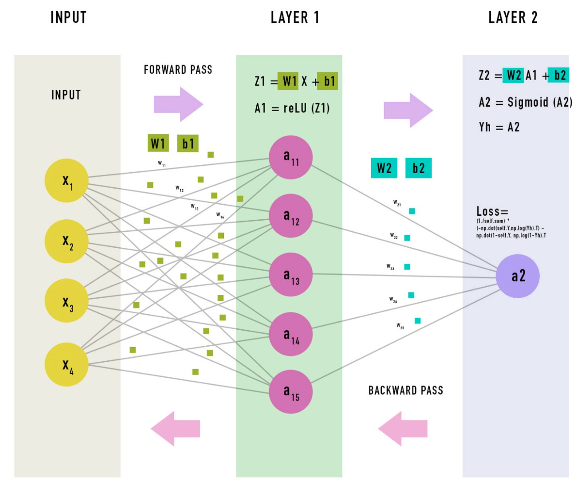

# Creating a deep learning framework using only numpy
### Trying to whitebox a blackbox neural net by building it from scratch (also without sklearn)

 

Current steps (Okt 3, 14:15)
1. Add activation functions
2. Add deactivation functions
2. Add all loss functions
4. Make current book dynamic with activations and losses

 

